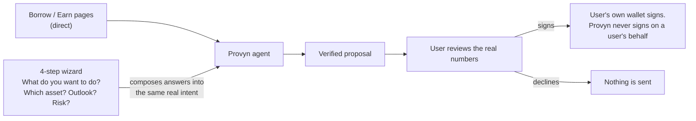
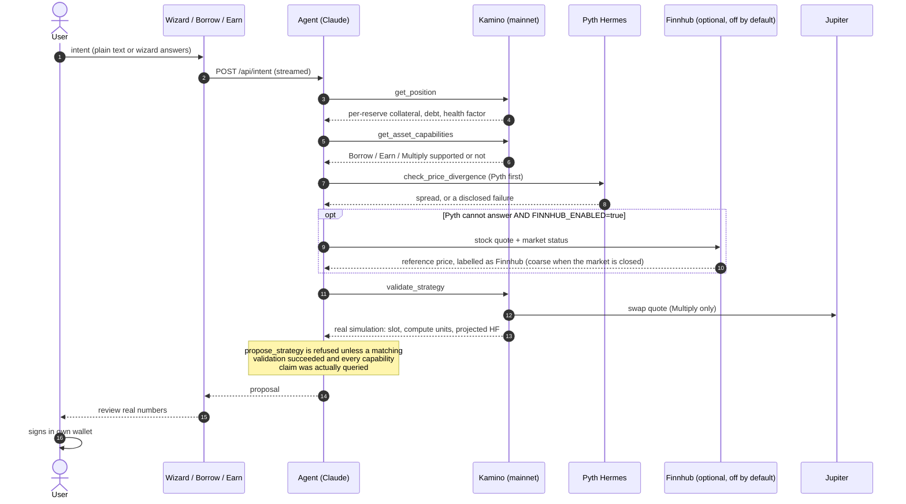
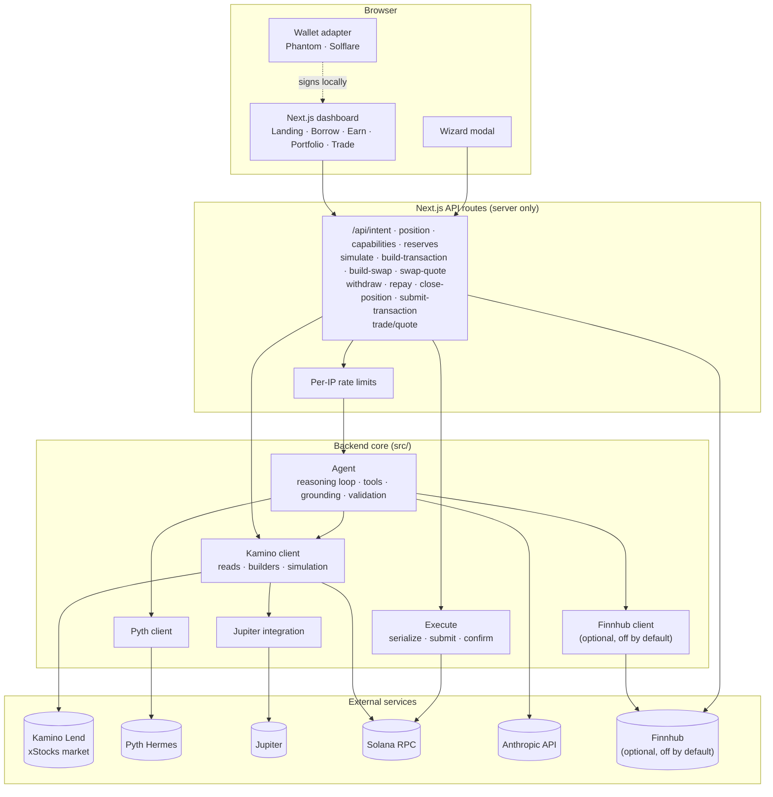
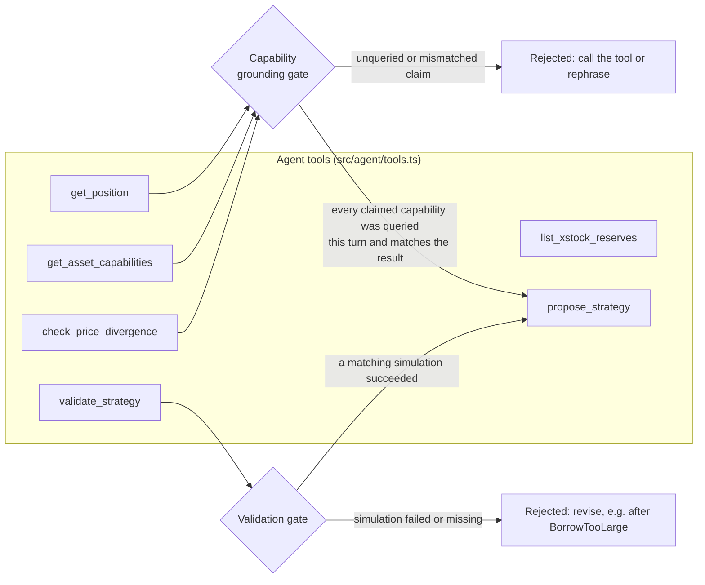
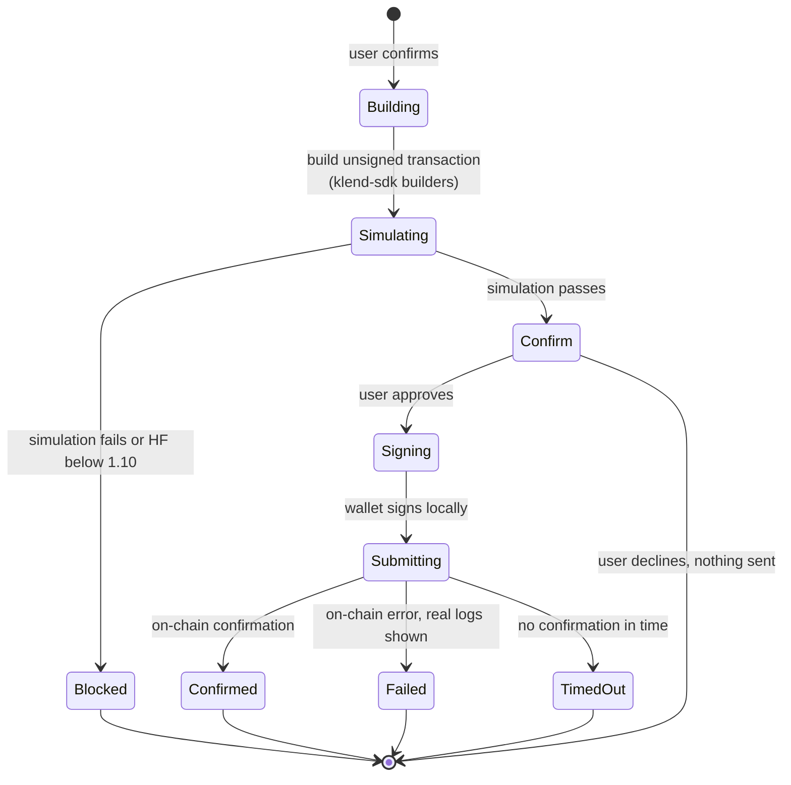
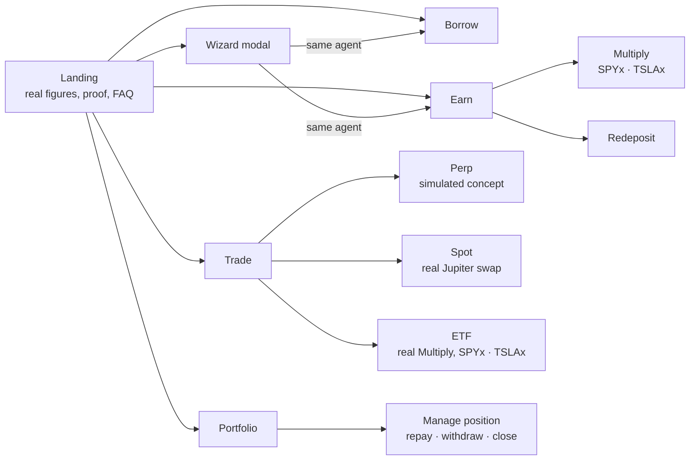
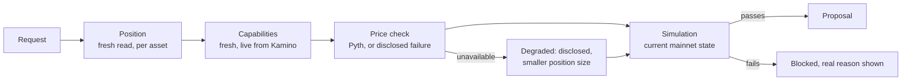

# Provyn

Provyn (formerly Parity)

Provyn is an onchain prime brokerage for tokenized stocks. It turns an xStocks portfolio into working capital. You can borrow stablecoins against AAPLx or SPYx, earn yield by redepositing them into Kamino's lending pool, add leverage through Kamino Multiply, and trade through Jupiter, all from one interface. Describe what you want in plain language or pick it from a guided wizard. Provyn reads your real Kamino position, simulates the transaction before showing you anything, and cross-checks the asset's price against Pyth whenever Pyth can answer. You only ever sign something that has already been proven to work. Funds can come from any chain through deBridge.

- **Demo video:** https://vimeo.com/manage/videos/1230313058
- **Repository:** https://github.com/Shanks-btc/Provyn
- **Live app: https://dashboard-production-d8bb.up.railway.app/

## Contents

- [The problem](#the-problem)
- [What Provyn does](#what-provyn-does)
- [How it works](#how-it-works)
- [Architecture](#architecture)
- [The agent](#the-agent)
- [The transaction pipeline](#the-transaction-pipeline)
- [The product surfaces](#the-product-surfaces)
- [What the model does, and what it never does](#what-the-model-does-and-what-it-never-does)
- [Verification](#verification)
- [Guarantees](#guarantees)
- [Trust and safety model](#trust-and-safety-model)
- [What the runs have shown](#what-the-runs-have-shown)
- [Current status](#current-status)
- [Public endpoints](#public-endpoints)
- [Quick start](#quick-start)
- [Testing](#testing)
- [Repository layout](#repository-layout)
- [Known limitations](#known-limitations)
- [How I approach the build](#how-i-approach-the-build)

## The problem

Retail margin is expensive and manual. A major brokerage's own published small-balance margin rate is roughly 11.8%; Provyn's live rate on Solana via Kamino is currently in the 7% range, checked directly against Kamino's market, not estimated. But cheaper access isn't the interesting part on its own. The interesting part is that most tools in this space will happily show you a recommendation built on stale data, an unavailable price feed, or an assumption about your position that was never actually checked. Provyn is built so that can't happen quietly.

I built Provyn around a simple question: **what should an agent be allowed to tell a user before it's actually checked?** A recommendation that sounds confident isn't the same as one that's been verified against real state, and a system that can't tell the difference will eventually propose something wrong with total conviction. Every proposal Provyn makes has to survive contact with a real position, a real price check and if any of those can't be completed, the agent has to say so, not fill the gap with a guess.

## What Provyn does

Provyn makes the agent's claim no stronger than what it actually checked.

| Principle | What it means |
|---|---|
| **Real checks, not a form** | Every proposal is preceded by a live read of the user's actual position, not a number they typed in. |
| **Causal grounding, not vibes** | The agent doesn't just say "yield on SPYx", it reads what that specific asset actually supports (Borrow, Earn, Multiply are asset-dependent, and the agent is not allowed to claim a capability it hasn't queried this turn). |
| **Degradation is explicit, never silent** | The price check tries Pyth first. If Pyth can't answer, the agent says so and sizes conservatively, proven directly, not just described, by the account's real entitlement gap. (An optional Finnhub stock-quote fallback exists in the code and is off by default; see Known limitations.) |
| **Non-custodial by construction** | Provyn never holds a user's keys or funds. Every transaction is built unsigned, and the user's own wallet signs it. |

The product rests on one boundary:

> **The model reasons and explains. Real chain state decides what is allowed to be proposed.**

**Project stage.** The backend is fully live-verified against Solana mainnet: real Kamino market reads, real obligation reads, real transaction simulation, real Jupiter swap construction. The sign to submit to confirm pipeline is proven end-to-end on devnet. Every mainnet transaction type has been built and simulated successfully against live mainnet state; a real signed mainnet transaction has not yet been made.

## How it works

A user reaches a proposal two ways, directly through the Borrow/Earn pages, or through a 4-step wizard (What do you want to do? → Which asset? → Market outlook? → Risk tolerance?) that composes the answers into the same real intent and runs the same real agent. Both paths call identical backend code; the wizard is a different way to reach the same real reasoning, not a separate simplified version of it.



**The flow:** state intent → agent checks position and capabilities → agent checks price → agent simulates the transaction → agent proposes → user signs.

1. The agent reads the user's real Kamino obligation — per-asset collateral, borrow, and health factor, not an aggregate.
2. It checks which capabilities (Borrow, Earn, Multiply) the specific asset actually supports right now, live.
3. When Pyth can answer, it cross-checks the asset's price against Pyth's real feed. A stale or unavailable check is flagged explicitly rather than proceeding as if it succeeded.
4. It simulates the exact transaction against live mainnet state and only proposes a strategy once that simulation passes.
5. The user reviews the real numbers and signs, or doesn't. Provyn never signs on a user's behalf.

### Proposal sequence

1. The agent reads the user's real position (`get_position`) — per-reserve, not aggregate.
2. It checks the asset's live capabilities (`get_asset_capabilities`) — never asserted from memory or the asset's name alone.
3. It checks the asset's price against Pyth (`check_price_divergence`). A blocked or stale check is disclosed, not hidden. (The result names its source; an optional Finnhub fallback is off by default.)
4. It builds and simulates the actual transaction (`validate_strategy`) against live mainnet state.
5. Only after all of the above succeed (or explicitly degrade with disclosure) does it produce a proposal (`propose_strategy`) for the user to review.
6. The user signs, or doesn't. Nothing is submitted without their signature.



## Architecture

| Layer | Responsibility | Primary location |
|---|---|---|
| Backend | Kamino/Pyth/Jupiter integration (Finnhub optional), transaction construction and simulation | `src/` |
| Agent | Reasoning loop, tool definitions, grounding checks, strategy validation | `src/agent/` |
| API | Server-side routes wrapping the backend for the dashboard | `dashboard/app/api/` |
| Dashboard | Landing, Borrow, Earn, Portfolio, Trade, wizard | `dashboard/app/`, `dashboard/components/` |
| Wallet | Real Phantom/Solflare connection via wallet-adapter | `dashboard/components/wallet/` |



### Core components

| Component | What it does | Where it lives |
|---|---|---|
| Kamino client | Market/reserve/obligation reads, transaction construction, simulation | `src/kamino/` |
| Pyth client | Live price feed reads via Hermes: the first-choice price check | `src/pyth/` |
| Finnhub client | Optional, off by default (`FINNHUB_ENABLED`): stock quote and market status for the price-check fallback, the Trade price band and the risk-data reference series | `src/finnhub/` |
| Jupiter integration | Swap quoting and standalone swap construction | `src/kamino/jupiter.ts` |
| Agent core | Claude-driven reasoning loop, tool definitions, grounding checks, strategy validation | `src/agent/` |
| Position management | Repay, withdraw and close for Vanilla obligations | `src/agent/manage.ts` |
| Dashboard | Landing, Borrow, Earn, Portfolio, Trade, the wizard | `dashboard/` |
| Wizard | Guided 4-step intent flow, feeds the same real agent | `dashboard/components/wizard/` |

## The agent

The agent has six tools, and two gates that sit in front of its only way to produce a proposal.



- **Capability grounding** ([grounding.ts](src/agent/grounding.ts)). Every `assetCapabilities` entry must be for a symbol queried in this conversation and must match what `get_asset_capabilities` returned. A summary or risk line that makes a capability claim about an asset that was never queried is rejected. It is deliberately strict: a false positive costs one extra tool call, a false negative is exactly the ungrounded claim the gate exists to stop.
- **Validation gate** ([validate.ts](src/agent/validate.ts)). `propose_strategy` is gated on a matching successful `validate_strategy`, and the proposal carries `validation.simulatedAtSlot`.

## The transaction pipeline

Nothing is sent without a signature from the user's own wallet, and nothing is shown for signing until a real simulation has passed.



| Stage | Where | Notes |
|---|---|---|
| Build | `dashboard/app/api/build-transaction`, `src/kamino/` | Real klend-sdk instructions; Multiply uses address lookup tables to fit Solana's 1232-byte limit |
| Simulate | `src/agent/validate.ts`, `src/kamino/execute.ts` | `simulateTransaction` against live mainnet, signature verification off |
| Review | `dashboard/components/app/TxModal.tsx` | One dialog: confirm, progress (cannot be dismissed), then outcome |
| Sign | Wallet adapter | Phantom or Solflare, in the user's browser |
| Submit and confirm | `/api/submit-transaction`, `src/kamino/execute.ts` | Rejects malformed or unsigned input before the network |

In the UI, a projected health factor below **1.10** blocks the action, and below **1.50** is flagged as risky.

## The product surfaces



| Surface | What it is | Real or simulated |
|---|---|---|
| **Landing** | Live market figures from `dashboard/lib/market-snapshot.json`, refreshed with `npm run snapshot:landing`, never hand-edited | Real |
| **Wizard** | Four steps (goal, asset, outlook, risk) composed server-side into a real intent for the real agent | Real agent |
| **Borrow** | Deposit an xStock, borrow USDC against it, simulate, sign | Real |
| **Earn** | Supply USDC for yield; Multiply on SPYx and TSLAx; redeposit | Real |
| **Portfolio** | Real wallet balances and Kamino positions, with repay, withdraw and close for Vanilla obligations | Real |
| **Trade: Perp** | Concept only. No live equity-perpetual market exists anywhere on Solana yet, so it has a simulated chart, book and tape and deliberately no order-submit action | Simulated |
| **Trade: Spot** | A real in-app swap through Jupiter, with measured fee and rent | Real |
| **Trade: ETF** | A presentation of the real Multiply flow as two product cards (SPYx and TSLAx). The card's leverage is the real `DEFAULT_LEVERAGE` from [lib/multiply.ts](dashboard/lib/multiply.ts), and the market stats beneath it are live from Kamino and labelled as other users' activity | Real |

## What the model does, and what it never does

| The model does | The model never does |
|---|---|
| Interprets the user's intent | Invents a position, price or rate |
| Decides which tools to call and in what order | Claims a capability it has not queried this turn |
| Explains the result and the risks in plain language | Treats a failed or missing price check as passed |
| Revises a proposal after a real simulation failure | Proposes anything that has not passed a real simulation |
| | Signs or sends a transaction |

## Verification

Provyn's verification layer is load-bearing, not decorative: every proposal is checked against real position data, a real price feed, and a real transaction simulation, and the result changes what the agent is allowed to say. Remove any one of these checks and the agent cannot tell a safe proposal from an unsafe guess.

**What is verified.** Three things, every time, before a proposal is assembled: the user's real per-asset position (not an aggregate), the asset's real capabilities (Borrow/Earn/Multiply, live from Kamino, not assumed from the asset's name), and the transaction's real outcome under simulation (projected health factor, compute cost, whether it would actually succeed on mainnet).

**How a fresh request verifies it.** Every call to the agent is independent — there is no cached position or capability assumption carried between requests. The position is read fresh, the capability check runs fresh (with a short-lived cache only as a fallback if Kamino's own API is slow, never as a substitute for a real check), and the simulation is run fresh against current mainnet state.

**What changes because of it.** A proposal's size, its stated risks, and whether it's shown at all depend directly on these checks. A wallet with a lower health factor gets a more conservative proposal. A blocked Pyth check produces an explicit disclosure and a smaller position size, not a silently confident one. A failed simulation (confirmed directly: an oversized borrow rejected with Kamino's real `BorrowTooLarge` error) blocks the proposal from being shown at all.

**What breaks if verification is removed.** The agent would have no way to distinguish a real position from an assumed one, a live capability from a stale one, or a transaction that would succeed from one that would fail on-chain. It would still sound confident — it just wouldn't be trustworthy.

**Data sources.** Kamino Lend (positions, reserves, simulation), Pyth Network (first-choice price verification, currently entitlement-blocked for equities), Finnhub (optional stock quote fallback, off by default), Jupiter (swap quotes and construction), Solana mainnet (the ground truth all of the above reads against).



## Guarantees

Each of these is enforced in code.

| Guarantee | How | Where |
|---|---|---|
| A proposal is never based on a typed-in position | Position is read fresh from Kamino on every request | `src/agent/tools.ts` |
| A capability is never asserted from memory | The grounding gate rejects unqueried or mismatched claims | `src/agent/grounding.ts` |
| A proposal never appears without a passing simulation | `propose_strategy` is gated on a matching successful `validate_strategy` | `src/agent/validate.ts` |
| A failed price check is never hidden | The agent must disclose it and size conservatively | `src/agent/core.ts` |
| Nothing is sent without the user's signature | Transactions are built unsigned; the wallet signs locally | `dashboard/lib/execute.ts` |
| Unsigned or malformed submits never reach the network | Input is validated first and rate limited | `dashboard/app/api/submit-transaction` |
| Transient RPC failures do not fail a real check | Quick retry on HTTP 429 and transient errors | `src/kamino/rpc-retry.ts` |
| The Trade concept cannot place an order | There is no submit action in the Perp UI | `dashboard/components/trade/TradeControls.tsx` |
| The ETF leverage cannot drift from the real build | Cards and the build request read one shared constant | `dashboard/lib/multiply.ts` |

## Trust and safety model

### Network separation

| Purpose | Network | Write policy |
|---|---|---|
| Position/reserve/price reads | Solana mainnet | Read-only |
| Transaction simulation | Solana mainnet | Simulated, never submitted without a user signature |
| Sign→submit→confirm pipeline proof | Solana devnet | Real, confirmed, no real-value funds involved |
| Trade page data | Simulated, client-side | No network calls, no real market to execute against |

### Rate limiting and fail-closed behavior

`/api/intent` (the agent's real reasoning loop) is rate-limited per IP, since every call is real, billed inference. `/api/submit-transaction` rejects malformed or unsigned input before it reaches the network. If a live capability check times out, the system falls back to the last successfully cached result rather than fabricating data, and logs that the fallback path was used.

| Route | Limit |
|---|---|
| `/api/intent` | Per IP, per 10 minutes |
| `/api/submit-transaction` | 8 per minute per IP |
| `/api/build-swap` | 8 per minute per IP |
| `/api/swap-quote` | 30 per minute per IP |
| `/api/trade/quote` | Per IP per minute, with a 15 second server cache |

Limits are in memory on a single replica.

### Secret handling

Local secrets live in a gitignored `.env` / `.env.local`. Production secrets are set directly on Railway, never committed. The dashboard's public-facing RPC key is domain-restricted separately from the backend's private key.

## What the runs have shown

| What happened | What it proved |
|---|---|
| A real deposit/borrow simulation against AAPLx returned Kamino's own live oracle price (339.02) captured mid-transaction, not a cached or assumed value. | The numbers come from the chain |
| A negative-carry strategy (borrowing to redeposit for yield) was correctly identified as unprofitable at current real rates, and the agent's own reasoning states it won't recommend the strategy until the math turns positive — proven on a real run, not asserted in copy. | The agent reasons from real rates |
| A decimal-scaling bug (human-readable amounts passed where the SDK expected raw integer units) was caught by a real `bn.js` "Invalid character" error during simulation, not a code review. | Simulation catches what review misses |
| A stale, inflated Jupiter quote reused for an actual swap was caught by Jupiter's own real `6024` error; the fix fetches a fresh quote for the exact amount actually being borrowed. | Quotes are fetched fresh for the exact amount |
| An instruction-ordering defect in a combined deposit+borrow transaction was caught by Kamino's real `InvalidAccountInput` rejection, not discovered by inspection. | Real rejections, not inspection |
| When Pyth's equity feed returned a real 403 (confirmed: `no grant accepts this feed (asset type 'equity'...)`), the agent's grounding check correctly forced a fallback proposal rather than silently proceeding as if the check had passed. | Degradation is explicit |

## Current status

| Surface | Status | Meaning |
|---|---|---|
| Backend | Live-verified, mainnet | Real Kamino/Pyth reads, real transaction simulation, all against live mainnet state |
| Frontend | Deployed on Railway | Next.js, real API routes wrapping the backend |
| Wallet connection | Real, tested | Phantom/Solflare via wallet-adapter, verified against a real extension |
| Signing | Devnet proven, mainnet simulated | Sign→submit→confirm pipeline confirmed end-to-end on devnet; every mainnet transaction type built and simulated, not yet signed live |
| Pyth equity and xStock feeds | Blocked | Current API key lacks entitlement; the Pyth success path is untested for that reason, and the agent's disclosed 'unavailable' path is what runs |
| Finnhub (optional) | Built, off by default | Opt-in with `FINNHUB_ENABLED=true`. Finnhub's free plan is personal-use only and bars sharing its data or derived results without written approval, so the price-check fallback, the Trade price band and the stock-reference series are all off unless enabled. Off, the agent behaves exactly as before: Pyth, then a disclosed 'unavailable' |
| Trade | Concept only | No live equity-perpetual market exists anywhere on Solana yet |
| Spot swap, ETF tab, position management | Built, not yet in the deployed build | Newer than the last Railway deploy; deploying needs `ANTHROPIC_API_KEY` set on Railway |

## Public endpoints

| Service | URL |
|---|---|
| Provyn dashboard | `<insert current live Railway URL once redeploy is confirmed>` |
| Repository | https://github.com/Shanks-btc/Provyn |

## Quick start

### Requirements

- Node.js 18+
- A Solana RPC provider (a dedicated one — the public endpoint reliably times out on real Kamino reads)
- API keys: Anthropic and Pyth. Finnhub only if you opt in (`FINNHUB_ENABLED=true`) and your licence permits it

### Install

```
git clone https://github.com/Shanks-btc/Provyn.git
cd Provyn
npm install

cd dashboard
npm install
```

### Run locally

```
# Backend verification (run from repo root)
cp .env.example .env   # fill in ANTHROPIC_API_KEY, SOLANA_RPC_URL, PYTH_API_KEY, KAMINO_MAIN_MARKET
npm run check:market
npm run check:feeds

# Frontend
cd dashboard
cp .env.example .env.local
npm run dev
```

### Useful commands

| Command | Purpose | Network/write behavior |
|---|---|---|
| `npm run check:market` | Confirms Kamino market/reserve reads | Real mainnet reads |
| `npm run check:multiply` | Reads Kamino's live Multiply metrics | Real mainnet reads |
| `npm run check:execute` | Builds and simulates a deposit | Mainnet simulation, nothing sent |
| `npm run check:yield` | Builds and simulates a USDC deposit | Mainnet simulation, nothing sent |
| `npm run check:multiply-deposit` | Builds and simulates a SPYx Multiply open | Mainnet simulation, nothing sent |
| `npm run check:feeds` | Confirms Pyth connectivity | Real Hermes reads |
| `npm run check:agent` | Runs the full agent reasoning loop against a real wallet | Real mainnet reads, real Anthropic spend |
| `npm run check:send-devnet` | Serialize, sign, submit and confirm on devnet | Devnet only, throwaway keypair |
| `npm run snapshot:landing` | Refreshes the live figures shown on the landing page | Real mainnet + Kamino API reads |
| `npm run check:price` | Verifies the price check with the optional Finnhub fallback on (live and mocked states) and off (the default) | Real Pyth, Kamino and Finnhub reads, no spend |
| `npm run collect` | Long-running risk-data collector: on-chain oracle price and multiplier every 5 min and market state every 30 min, written to append-only files under `data/riskdata` (`-- backfill` imports Kamino's hourly history; `-- export <file>` writes a public-safe CSV). The stock-reference and gap series are recorded only with `FINNHUB_ENABLED=true` | Real Kamino reads, no signing |
| `npm run check:riskdata` | Failure-injection and idempotency checks for the collector, on a throwaway directory | Local only |

## Testing

Every check runs against real infrastructure. There are no mocks in the backend checks, and mainnet checks never sign or send. The full sequence, with dated results and the test wallets, is in [TESTPLAN.md](TESTPLAN.md).

| Area | How it is verified |
|---|---|
| Backend | The `check:*` scripts above |
| Agent | `check:agent` runs two real intents and requires a real mainnet simulation (slot and compute units) inside `validate_strategy`, and a `propose_strategy` accepted by both gates |
| Sign pipeline | `check:send-devnet` confirms success, an on-chain failure with logs, and a timeout |
| Responsive layout | Headless Chrome at 375, 390, 768, 1024, 1280, 1440 and 1920 px: no horizontal overflow, nav and section layouts per breakpoint |
| Wallet connection | The app's real wallet-adapter code, with zero RPC calls during connect and disconnect |

## Repository layout

```
src/
  kamino/       market/reserve/obligation reads, transaction builders, simulation, Jupiter swap construction
  pyth/         Hermes price feed client
  finnhub/      optional stock quote and market status client (off by default)
  agent/        reasoning loop, tool definitions, grounding checks, strategy validation
dashboard/
  app/          landing, borrow, earn, portfolio, trade, api routes
  components/   wizard, wallet connection, landing sections, trade UI
scripts/        live-data snapshot generation for the landing page
TESTPLAN.md     the full live verification sequence and its real, dated results
```

## Known limitations

- **No real signed mainnet transaction yet.** Every mainnet transaction type has been built and simulated against live state, and the sign pipeline is proven on devnet. The first real signature is still ahead.
- **Pyth equity and xStock feeds are blocked.** The key lacks entitlement, so the Pyth success path is untested. The agent says the check is unavailable and sizes conservatively.
- **Finnhub is opt-in and off by default.** Its free plan is personal-use only and its terms bar sharing its data or "derived results" without written approval, so nothing public or business-facing may depend on it. The price-check fallback, the Trade price band and the stock-reference series run only with `FINNHUB_ENABLED=true`. When enabled, the check is coarse while US markets are closed (the quote is the last close, so a gap can be an after-hours move).
- **Trade Perp is a concept.** No live equity-perpetual market exists on Solana. It is simulated and cannot place an order.
- **Position management is Vanilla only.** Repay, withdraw and close cover plain Kamino obligations. Unwinding a Multiply position means reversing a flash loan and a swap, and is separate work.
- **Multiply leverage is Kamino's to manage.** After a position opens, Provyn does not rebalance or monitor it. Provyn can't close Multiply positions yet, so close one in Kamino's app.
- **Rate limits are in memory.** They are per-IP, on a single replica, and reset on restart.
- **Swaps are exact-input only.** Jupiter has no exact-output routes for xStocks.

## How I approach the build

- Make the agent's claim no stronger than what it actually checked.
- Never let a proposal survive on an assumption a real read could have replaced.
- Store the real reason a check failed, not just that it did.
- Degrade explicitly when a dependency is unavailable, rather than filling the gap with a guess.
- Verify a builder's real API surface against the installed source, not the README — documentation goes stale before code does.
- Independently re-confirm every on-chain claim against a live RPC call, not just an SDK's own response.
- Stop before signing anything real, and say exactly what's ready, rather than assuming authorization that was never given.

---

An onchain prime brokerage for tokenized stocks, built for Stocklana (Solana Foundation hackathon). Kamino for collateral and yield, Pyth for price cross-checks whenever its feeds can answer, Claude for the reasoning loop.
